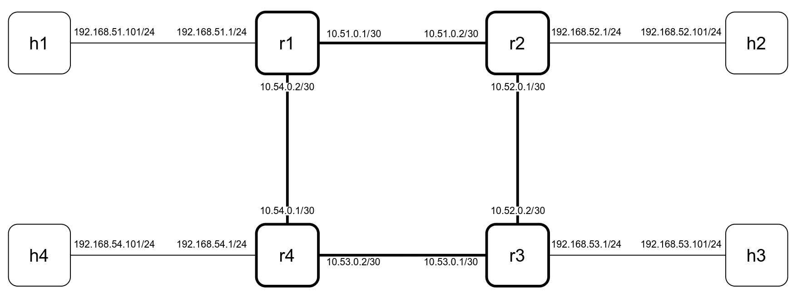
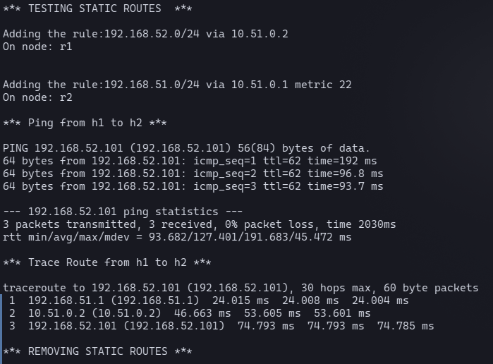
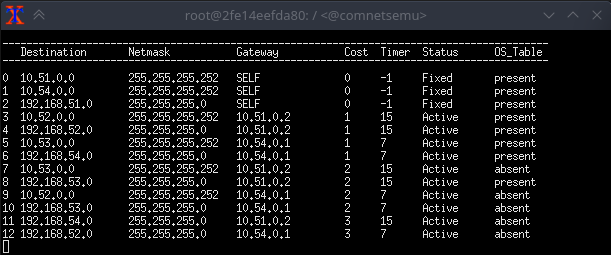
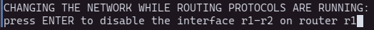
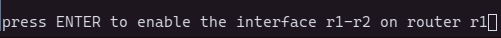
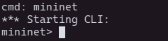
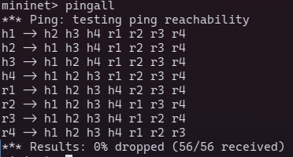
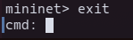
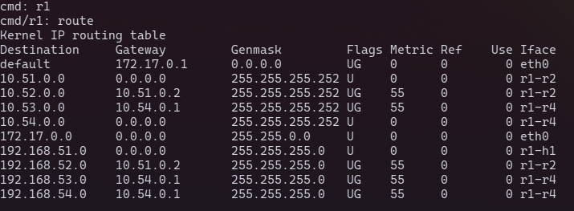

# Implementing a router in the ComNetsEmu environment

Comnetsemu is a lightweight network-emulation environment that brings modern capabilities into the well-known Mininet environment. One of these is the ability to deploy containerized applications on hosts, a feature that is widely used in today's real world scenarios, and it constitues the roots of this router implementation project. 

## Objectives of the project:

- To implement a router device in the ComNetsEmu environment
- To implement both static and dynamic routing

## Choices

The `DockerRouter` class is directly inherited from the `DockerHost` class. This is done to make the dynamic routing protocol run as a container. 

Inside the container a slightly  modified RIPv1 protocol is implemented. RIP has been chosen since of its low complexity and consequently the ease of code reading. 

Outside the container, directly in the DockerRouter class, the static routing is implemented as a list of class methods, wich are reachable from the topology definition script.

To make the definition of a new topology as familiar as possible, while keeping the new files separated from the main source code, 2 other elements are inherited and modified: 
- `Containernet` (from `comnetsemu.net`) to create `Routernet`
- `DockerHost` (again)(from `comnetsemu.node`) to create `RNET_Host`

`Routernet` contains a new method (addDockerRouter), that lets the user add the router in a similar way as other elements (such as switches, hosts, ... ) are added.

`RNET_Host` contains a new method (setPseudoGateway), wich is a workaround to use the internal (between nodes) connections as a Default Gateway, without giving up the Internet access capability.

The image `d_host` is used inside of the hosts to have useful network tools later on.
Both of the images (d_host, d_router) can be built using the `buildall.sh` script, inside the `_addition/docker` folder.


## Useful code snippets (to use in order)

1. To create a network and a controller:
```python
	net = Routernet(controller=Controller, link=TCLink)
	net.addController("c0")
```
2. To add a single host:
```python
	h1 = net.addHost(
		"h1",
		cls=RNET_Host,
		dimage="d_host",
		ip="192.168.51.101/24",
		docker_args={"cpuset_cpus": "0","nano_cpus": int(1e8)},
	)
```
3. To add a single router:
```python
	r1=net.addDockerRouter("r1")
```
4. To connect the nodes:
```python
	net.addLink(h1, r1, bw=10, delay="10ms", intfName1="h1-r1", intfName2="r1-h1")
```
5. To set the IPs of the routers:
```python
	r1.setIP("10.51.0.1",30,"r1-r2")
```
6. Before starting the network, ip_forwarding needs to be disabled on the virtual machine:
```python
	os.system("sudo sysctl net.ipv4.ip_forward=0")
```
7. To add static routes:
```python
	r1.initStaticRoutes()
	r1.addStaticRoute("192.168.52.0/24","10.51.0.2")
	# ADDITIONAL PARAMETERS CAN BE ADDED:
	# metric
	# device (interface)
```
8. To remove static routes:
```python
	r1.clearStaticRoutes()
```
9. To spawn a xTerminal for a given router:
```python
	spawnXtermDocker("r1")
```

# Demonstration

For the demo, the topology in the picture below has been chosen. This way, the network contains multiple paths for the same destinations, while having also a loop of routers. Giving the routing protocols a purposly difficult scenario we can test their capabilities in these kind of situations.



## How to install and run the demo

1. Download and copy the entire `comnetsemu-router` folder in the main folder of comnetsemu:
	```
	comnetsemu
	|- comnetsemu-router
	|- app
	|- bin
	|- comnetsemu
	|- doc
	|- ...
	```
2. Run the Comnetsemu Virtual Machine, and ssh into it:
	```
	vagrant up comnetsemu
	vagrant ssh comnetsemu
	```
3. Launch `buildall.sh` to build the required docker images
	```
	cd comnetsemu/comnetsemu-router/docker/
	./buildall.sh
	```
4. Run the demo:
	```
	cd comnetsemu/comnetsemu-router/
	sudo python3 ./demo.py
	```

5. At this point, a set of tests will start automatically. Firstly, static routing is tested. Routing rules are added in the routers `r1` and `r2`. Then a ping test between `h1` and `h2` starts, followed by a traceroute for the same nodes. 
	
	

6. After the static routing rules are removed, the dynamic routing part will start. One xTerminal for each router will pop-up. For each router, to start the protocol, the following command needs to be issued:
	```
	python3 ./home/main.py
	```

7. A routing table will appear. After a while, all the reachable paths are shown. 
	
	


	#### Reading the table:
	
	---
	

	- ___DESTINATION___ : The destination subnet

	- ___NETMASK___ : The netmask of the destination subnet

	- ___GATEWAY___ : The gateway to reach the destination subnet. If it is "SELF" it means  that it is directly connected.

	- ___COST___ : The cost of the route in terms of number of hops. This is the way the RIP protocol choses the best path. Lower is better.

	- ___TIMER___ : It counts the seconds since the last update.

	- ___STATUS___ : It could be "Active","Waiting","Invalid" or "toFlush", depending on different factors, mainly the timer value. The thresholds can be changed in the main.py file. By deafult they are:
		- 0 to 20 seconds : Active
		- 20 to 50 seconds : Waiting
		- 50 to 70 seconds : Invalid
		- 70 and above : toFlush
	
	  Those are not the real timings of the RIP protocol, wich are significantly longer. 

	- ___OS_TABLE___ : Once the routing protocol has decided wich path is the best for each destination, the routes get inserted in the OS routing table, to be used by the system to forward packets. So, "present" means that it is inserted in the OS Routing table, "absent" means that it's not.
	---

8. To see what happens when a network interface goes down, we can go back to the main terminal, and press ENTER:

	
  
	Doing this will cause the following behaviour:
	1. The fixed routes on router r1 disappear.
	2. The routes on r1 that depends on the removed interface go out-of-time, causing the same effect on the adiacent routers.
	3. After the timer exceeds the "toFlush" threshold, the route is deleted on r1.
	4. A ghost-route still exists in the different routes. This is going to be shared back and forth, each time with an increased cost.
	5. At some point the cost of the ghost-route exceeds the threshold of 15, and it is deleted.
	The whole process could take seconds to minutes, depending on the defined STATUS thresholds (see definition of "STATUS"(7)). In the default case all the routing table should get cleared in about 2 minutes.

9. To see what happens when the same network interfaces goes up again, we can press ENTER in the main terminal:

	
  
	After this is done, in less than a minute we should see the old routes coming back in the routing table.

10. Now in the main terminal a `cmd:` prompt should appear. Here we can hop into the mininet CLI, by typing `mininet`, and pressing ENTER.

	
  
	Every known mininet command can be used here. For example, typing `pingall` we can test the reachability of each node:
	
	

	Typing `exit` we can go back to the `cmd:` prompt:
	
	

11. In the `cmd:` prompt we can also give commands to specific nodes. For example, typing `r1`, we can enter the router-1 node, and typing `route` we can see the defined system routes:

	

	We can observe that all the routes that are labeled "present" in the RIP-table, are present here, with a metric of 55.
	We can type `exit` again to return to the `cmd:` prompt.
	Typing `exit` again will terminate the demonstration

---

### Main Sources:

- Gitlab/comnetsemu: https://git.comnets.net/public-repo/comnetsemu

- http://csie.nqu.edu.tw/smallko/sdn/mininet_simple_router.htm
- https://www.granelli-lab.org/researches/relevant-projects/comnetsemu-sdn-nfv-emulator
- https://www.sciencedirect.com/science/article/pii/B978012820488700027X
- https://stevelorenz.github.io/comnetsemu/
- https://mininet.org/
- https://github.com/mininet/mininet/blob/master/examples/linuxrouter.py
- https://docker-py.readthedocs.io/en/stable/containers.html#container-objects
